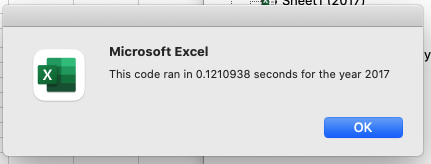
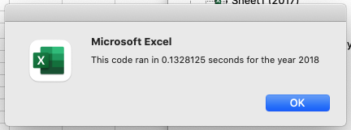

# All Stocks Analysis with VBA in Excel

## Overview of Project

### Purpose
Steve wanted to analyze the stock of a company called DAQO New Energy Corp (DQ) because his parents were passionate about green energy and wanted to invest all their money into it. Steve asked our help on an excel he created for analysis of both DAQO's stock and all other green energy stocks.  We used VBA scriopt and collected 12 different green enegry companies' stock performance in the year 2017 and 2018, including DAQO's. The purpose of this project is to refactor this VBA script to increase the efficiency of the original code so it takes less time for Steve to run through all stocks information and pull out the information he wants.

## Results

- The refactored code did increase the efficiency by reduce the run time of the code. The original code run time for 2017 and 2018 were 0,605 seconds and 0.578+ seconds. The refactored one only takes 0.121 seconds for 2017 and 0.133 for 2018.

- The original code was using nested for loops and print out the matched tickers. The outer loop ran through the 12 tickers and the inner loop ran through the rows. The refactored code, however, was only using seperate for loops. Two variables was used, i and j, referring to the rows and the 12 tickers. The code details are listed below.
   
   
   '1a) Create a ticker Index
    tickerIndex = 0

    '1b) Create three output arrays
    Dim tickerVolumes(12) As Long
    Dim tickerStartingPrices(12) As Single
    Dim tickerEndingPrices(12) As Single
    
    ''2a) Create a for loop to initialize the tickerVolumes to zero.
    For j = 0 To 11
        tickerVolumes(j) = 0
        tickerStartingPrices(j) = 0
        tickerEndingPrices(j) = 0
    Next j
        
    ''2b) Loop over all the rows in the spreadsheet.
    For i = 2 To RowCount
    
        '3a) Increase volume for current ticker
            tickerVolumes(tickerIndex) = tickerVolumes(tickerIndex) + Cells(i, 8).Value
      
        '3b) Check if the current row is the first row with the selected tickerIndex.
            If Cells(i - 1, 1).Value <> tickers(tickerIndex) And Cells(i, 1).Value = tickers(tickerIndex) Then
                tickerStartingPrices(tickerIndex) = Cells(i, 6).Value
            
            End If
        
        '3c) check if the current row is the last row with the selected ticker
            If Cells(i + 1, 1).Value <> tickers(tickerIndex) And Cells(i, 1).Value = tickers(tickerIndex) Then
                tickerEndingPrices(tickerIndex) = Cells(i, 6).Value
            End If
           
         '3d Increase the tickerIndex.
            If Cells(i, 1).Value = tickers(tickerIndex) And Cells(i + 1, 1).Value <> tickers(tickerIndex) Then
                tickerIndex = tickerIndex + 1
            End If
            
    Next i
    
      '4) Loop through your arrays to output the Ticker, Total Daily Volume, and Return.
    For j = 0 To 11
        
        Worksheets("All Stocks Analysis").Activate
        Cells(4 + j, 1).Value = tickers(j)
        Cells(4 + j, 2).Value = tickerVolumes(j)
        Cells(4 + j, 3).Value = tickerEndingPrices(j) / tickerStartingPrices(j) - 1
    
    Next j

## Summary
### Pros and Cons of Refactoring Code
- Refactoring Code in general gives a second thought to the original code we write. It will increase the efficiency of our code, refine logic loopholes and make the script look clean and organized. This not only helps the writer understand his code better in the future, but also benefits the users to run  programs with less time and computer energy.
- However, every coin has two sides. Refactoring the original code, which has been proved to be working, can bring in new bugs or conflicts with other programes in the main branch system.

### Pros and Cons of of the original All Stock Analysis VBA Script
### Pros and Cons of of the refactored All Stock Analysis VBA Script
